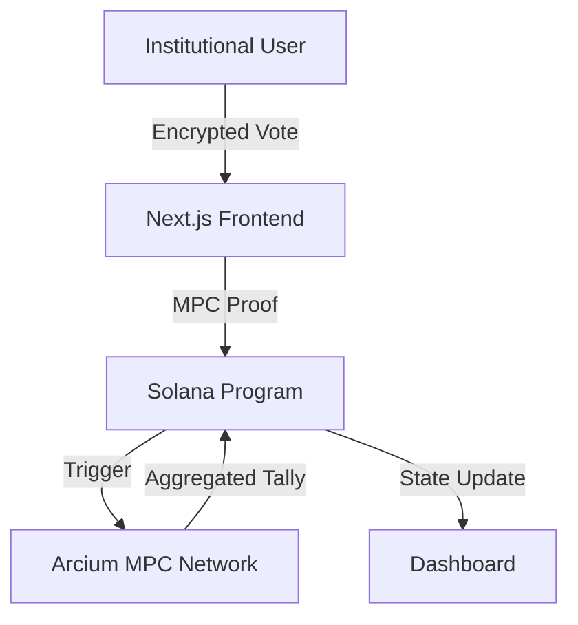

# Gov Encrypt: The Confidential Governance Layer

[](https://github.com/kellycryptos/Gov-Encrypt/actions/workflows/ci.yml)

**Gov Encrypt** is a production-grade, privacy-native governance protocol for institutional DAOs. Built on **Solana** and powered by **Arcium MPC**, it ensures that sensitive governance data—votes, delegation graphs, and reputation—remain confidential while enabling verifiable, aggregated decision-making.

## 🏗 Architecture



## 🏦 Token Model

| Asset | Type | Purpose |
| :--- | :--- | :--- |
| **$GOVE** | SPL Token | Native governance and staking asset. |
| **eREP** | Soulbound | Encrypted reputation earned via participation. |

## 🚀 Status & Roadmap
- [x] **v1.0**: Institutional UI & Multi-Circuit MPC Sync.
- [ ] **v1.1**: Compliance-Ready ZK-Proof Export.
- [ ] **v2.0**: Cross-Chain Confidential Governance.

## 🛠 Setup & Deployment

### Local Environment
```bash
docker-compose up -d
```

### Devnet Deployment
Refer to [devnet_deployment.md](./devnet_deployment.md).

## 📄 License
This project is licensed under the **MIT License**.
